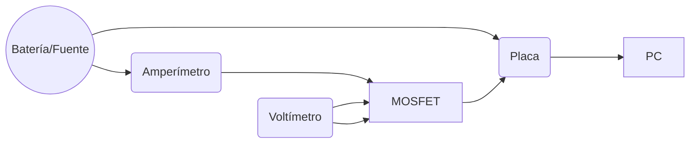

# Data Logger

Este es un programa complementario al de [Control para Carga Electrónica](https://github.com/kr4fty/Carga-Electronica-STM32).

***¡No se necesita una placa adicional ya que se usará la misma para tomar los datos y control!***

## Objetivo del Data Logger

La captura de datos tiene como objetivo:

- Obtener la **respuesta a un escalón** (step) de modo de analizar el comportamiento del MOSFET y la posterior obtencion de las constantes del PID (Kp, Ki, Kd).
- Determinar el valor del **Vgs Threshold**. Cada transistor presenta un Vgs-threshold unica y diferente, incluso del el mismo modelo y fabricante. Esto es crucial para analizar si el filtro activo necesita ganancia a la salida, recordando que la máxima salida de la placa es 3.3V.
- Tomar **muestras de corriente** para luego proceder con el análisis y la obtención de las funciones de regresión.

## Requisitos

- Multímetro para medir corriente (opcional: otro multímetro para medir la tensión Vgs).
- La placa de [Control de Carga Electrónica](https://github.com/kr4fty/Carga-Electronica-STM32).
- Software para capturar los datos enviados desde la placa Data Logger: [Serial Port Plotter](https://github.com/CieNTi/serial_port_plotter).
- Software Hoja de Cálculo (LibreOffice Calc, Excel, etc.) para realizar la regresión.
- Página [pidtuner.com](https://pidtuner.com/) para realizar la sintonización y obtención de las constantes PID.


## Diagrama para la Captura de los Datos



## Captura y Análisis de Datos

A continuación se describe el procedimiento para la captura y análisis de datos de un MOSFET utilizando el Data Logger y el software **serial_port_plotter**. El proceso esta dividido en tres etapas:

### 1. Respuesta al Escalón del MOSFET

- **Selección del MOSFET y Ciclo de Trabajo:**
  
  Al iniciar el programa, seleccione el MOSFET que desea analizar (MOSFET 1 o MOSFET 2) utilizando la perilla del encoder. Presione para continuar.

- **Configuración del Software:**
  
  Utilice la aplicación **serial_port_plotter** para la captura de datos. Asegúrese de que el software esté correctamente configurado para recibir datos desde el puerto serie.

  

- **Ajuste del Ciclo de Trabajo:**
  
  Comience con un **ciclo de trabajo** bajo (2400, por ejemplo) y aumente gradualmente hasta alcanzar un consumo de aproximadamente 1A. Una vez obtenido este valor, reinicie el Data Logger, ajuste el ciclo de trabajo al valor obtenido y ya con **serial_port_plotter** listo para capturar, comience el proceso.

- **Iniciación de la Captura:**
  
  Presione el botón para iniciar la captura de datos. La placa enviará un STEP (valor del Duty a 1A obtenido en el primer paso) al MOSFET. La placa leerá y analizará los datos, transmitiéndolos a la PC para su posterior análisis. Los datos se enviarán durante **10 segundos**.

- **Detención de la Captura:**
  
  Al finalizar la captura, detenga el proceso en **serial_port_plotter** y proceda al análisis de los datos (archivo **.csv** dentro de la carpeta del programa) utilizando el software de hoja de cálculo. Finalmente, cargue los resultados en la página [pidtuner](https://pidtuner.com/) para su posterior sintonización y obtención de parámetros.

#### Formato de Datos en serial_port_plotter

El programa **serial_port_plotter** recibe los datos en el siguiente formato:
``` Table
    Duty    Time    ADC I
    2982    11      538
    2982    22      539
    2982    33      540
    2982    44      538
    2982    55      540
    2982    66      539
    2982    77      540
    2982    88      540
    ...
```

Tener en cuenta que el tiempo se registra en **milisegundos**, por lo que antes de cargar los datos en la página deberán ser convertidos a segundos. Asegúrese de subir los datos de Time, Input (duty cycle) y Output (Isense) para realizar la sintonización.

### 2. Obtención de Vgs-Threshold del MOSFET

- **Variación del Ciclo de Trabajo:**
  
  Para determinar la Vgs-threshold del MOSFET, varíe el ciclo de trabajo utilizando un encoder desde un valor bajo (ejemplo 2400) e ir aumentando el duty hasta notar en el amperimetro comienza a marcar circulacion de corriente. En este punto medimos la Vgs y dicho valor de tensión es la que llamaremos **Vgs Threshold** (tener en cuenta tambien Duty para esa Vgs-Threshold).

### 3. Captura de Muestras y Obtención de Funciones por Medio de una Regresión Polinómica

- **Captura de Muestras:**
  
  Realice una captura de aproximadamente 25 muestras(cuanto mas muestras se tomen, mas exacto va a ser la regresion) variando el ciclo de trabajo, desde el Duty Vgs-Th hasta alcanzar una corriente de 3 a 4A. Evite exceder este rango para prevenir el sobrecalentamiento del MOSFET y su posible destrucción.

- **Registro de Datos:**
  
  Para cada muestra, registre el ciclo de trabajo (Duty), la corriente medida con un amperímetro externo y la corriente sensada por la placa en valores de ADC.

- **Análisis de Datos:**
  
  Una vez completada la captura de muestras, realice un análisis de regresión polinómica de grado 2 para obtener las siguientes funciones:
  
  - Corriente (en Amperes) en función del ciclo de trabajo (Duty).
  - Valores de ADC en función del ciclo de trabajo (Duty).

  

- **Exportación de Resultados:**
  
  Finalmente, exporte los parámetros PID y las funciones de regresión obtenidos a su programa de control.

**constantes.h**
```constantes.h
...

  // MOSFET
#define ADC_VGS_THRESHOLE  2650 // Tension minima de conduccion para este IRFZ44

// PID
//      https://pidtuner.com/
//          Proportional Gain= 15
//          Integral Time= 0,25
//          Derivative Time= 0.05
//          Integral Gain= 60
//          Derivative Gain= 0.75
#define KP               15
#define KI               60
#define KD             0.75
#define PID_WINDOW_SIZE  10 // 10 mili segundos

#endif
```

**conversion.h**
```conversion.h
...
/*********************** ADC en funcion del DutyCycle ************************/

// Coeficientes de la regresión polinómica, para MOSFET1
#define AM1  0.000454764917333275
#define BM1  -2.86027477489123
#define CM1  5032.90528137101
// MOSFET2
#define AM2  0.000228750264512528
#define BM2  -1.24017153035163
#define CM2  2222.8681053449

// Función para convertir Duty Cycle a ADC
double dutycycleToADC(int dutyCycle, uint8_t unity=MOSFET1)
{
    double a, b, c;
    switch (unity)
    {
    case MOSFET1:
        a = AM1; b = BM1; c = CM1;
        break;
    case MOSFET2:
        a = AM2; b = BM2; c = CM2;
        break;
    default:
        break;
    }
    return a * pow(dutyCycle, 2) + b * dutyCycle + c;
}
...
```